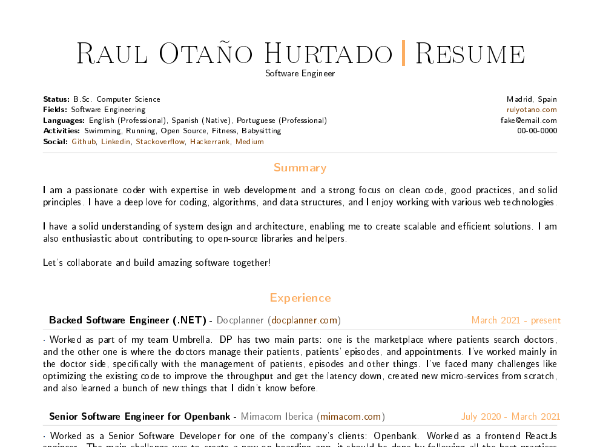

# My CV!

This is a repository I've created to generate my CV's in a more decent way than just using .docs files.

I've used Latex to create it by using a template from [Jan Küster](https://github.com/jankapunkt/latexcv). I've used the basic one because it can be compiled by using a very basic and light Latex distribution.

Also, I need to give some credits to [Ale Dominguez](https://github.com/adborroto) who inspired and also guided me. He wrote [this interesting Medium article](https://medium.com/geekculture/keep-your-cv-updated-like-a-developer-using-github-actions-latex-ab9820484147).

## How this works

1. Create your custom tex document in the `/templates` directory (I recommend using my one as base to be able to work with the same Latex build)
2. To test it in local, you can use the `Makefile` commands. You also will need to have docker installed. You can change or add new `compile` commands to use your template. Note that you will need to install `make` in your SO. Then you can use `make compile` command to compile. In case you get an error during the compilation and the docker container is still alive, you can execute the `make clean`. Make build (`make build`) is only used to build the image in local, useful if you want to customize it (note: need to change the `buildpdf` variable in order to use `cv` instead of the image from the dr)
3. Behind this, there is a docker image that I've named `rulyotano/latex-builder`. If the image file changes or the entry point file, this image is going to be updated. Check the `.docker/entrypoint.sh` file, because in here you will be able to add your custom mappings to private fields. In my case, so far, only email and phone. Note: you don't need to use the image I've created, you can build the image during the pdf creation action, and no need to push it to any docker registry.
4. To create the pdf file, I've created a manually triggered action to do that. To run this one you will need to pickup the template you want build (need to add it to the action definition file). Then the image is used to create build the pdf and then it is pushed it to a private github repository, in order to keep our privacy.

## Step-by-step to create your own working repo
1. Fork this repo.
2. Create your private repository. I've named my one `cv-private`. Note: Need to create a branch per pdf file. I also saved my secret config here.
3. Add your latex files in the templates directory. Define "secrets" or info you don't want to be public using `<<myemail>>` for instance.
4. Configure your repository action secrets (Settings > Secrets and variables > Actions). Need to define: `API_TOKEN_GITHUB` (github token to push to the private private ...pending reference about how to do it...) and `SECRETS` (format: `secret1=value1;secret2=value2;...;secretn=valuen`).
5. Update the `create-pdf.yml` action. Need to your templates to the options (line 8, options are the template file names without the .tex extension. Note that a branch with the same name should exist in the private repo). Need to configure your github user, github private repo and github email in lines from 34-36.

By doing these steps, you should be able to generate yours pdfs without even cloning the repo to your pc. 

## Sample image
